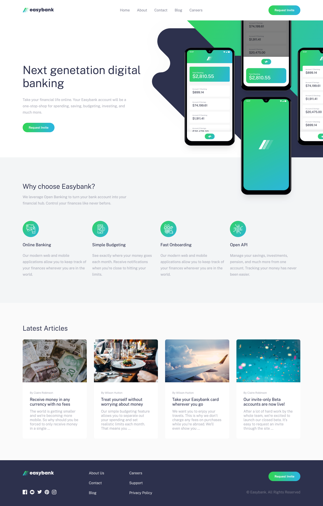
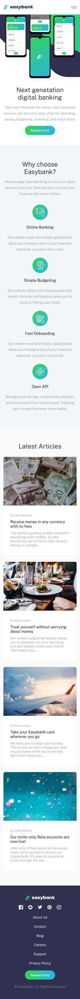
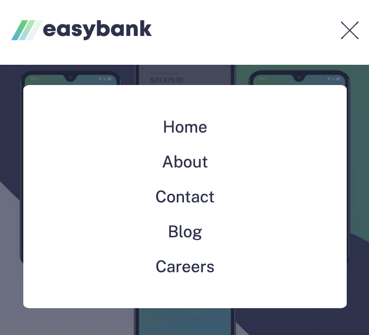

# Frontend Mentor - Easybank landing page solution

This is a solution to the [Easybank landing page challenge on Frontend Mentor](https://www.frontendmentor.io/challenges/easybank-landing-page-WaUhkoDN). Frontend Mentor challenges help you improve your coding skills by building realistic projects.

## Table of contents

- [Overview](#overview)
  - [The challenge](#the-challenge)
  - [Screenshot](#screenshot)
  - [Links](#links)
- [My process](#my-process)
  - [Built with](#built-with)
  - [Why with React](#why-with-react)
  - [What I learned](#what-i-learned)
  - [Useful resources](#useful-resources)
- [Author](#author)

## Overview

### The challenge

Users should be able to:

- View the optimal layout for the site depending on their device's screen size &check;
- See hover states for all interactive elements on the page &check;

### Screenshot







### Links

- Solution URL: [Frontend Mentor](https://www.frontendmentor.io/solutions/easybank-landing-page-solution-_lMMOD-IIL)
- Live Site URL: [Easybank](https://gifted-selection.surge.sh)

## My process

### Built with

- Semantic HTML5 markup
- Flexbox
- CSS Grid
- CSS modules
- Mobile-first workflow
- [Sass](https://sass-lang.com/) - preprocessor scripting language for css
- [React](https://reactjs.org/) - JS library framework
- [Vite](https://vitejs.dev/) - local development server

### Why with React

Beacuse maybe in the future the app needs to add others pages, add functnalties, in thats case it will be easier to do it with a library that can handle complex problems easier than vanila javascript.

### What I learned

I started this challnge to imporve my skills in styling and learn Sass <br />

Sass have a relly cool way to write css, for example: you don't need to write the parent class when selcting a specific element in the dom, you can just nested it in the class. <br />

css

```css
.classDemo {
  color: red;
}
.classDemo a {
  color: blue;
}
```

scss

```scss
.classDemo {
  color: red;
  a {
    color: blue;
  }
}
```

### Useful resources

- [Kevin Powell](https://www.youtube.com/@KevinPowell) - This guy is a css master, he have videos for a lot of css problems and how to solve it the right way.

## Author

- LinkedIn - [Mateeb Alharbi](https://www.linkedin.com/in/mateeb-alharbi/)
- Frontend Mentor - [@Mateeb11](https://www.frontendmentor.io/profile/Mateeb11)
